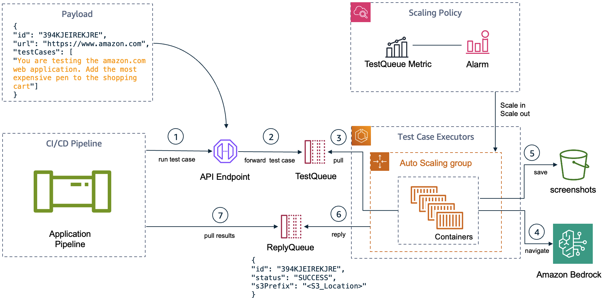
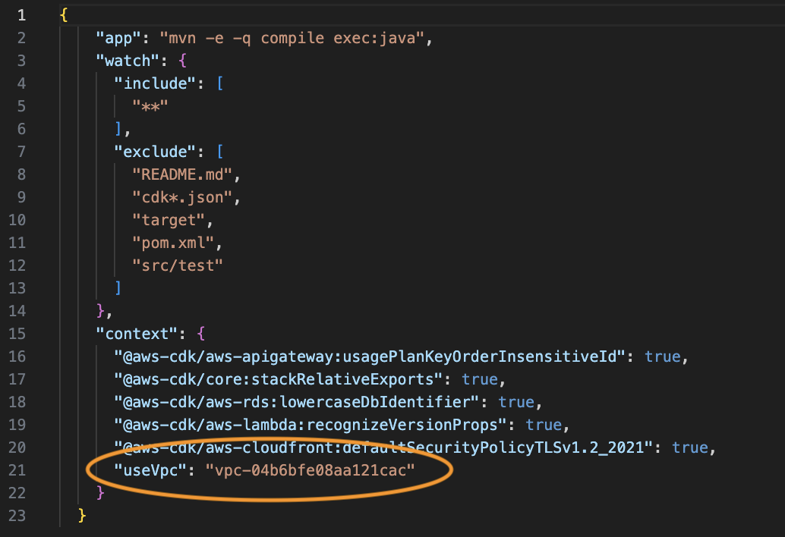
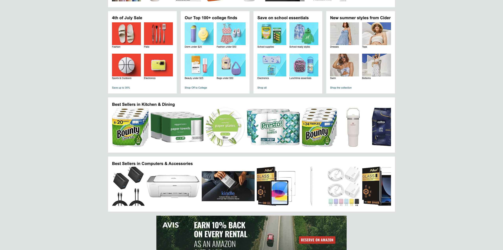
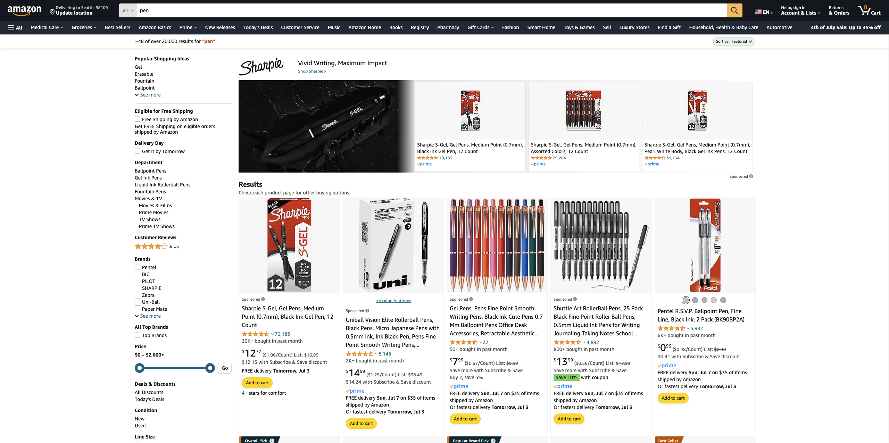
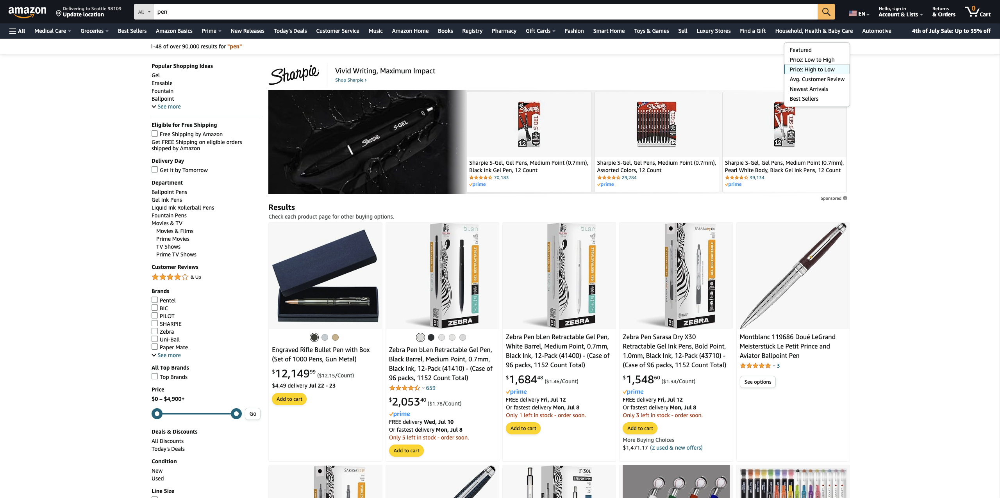
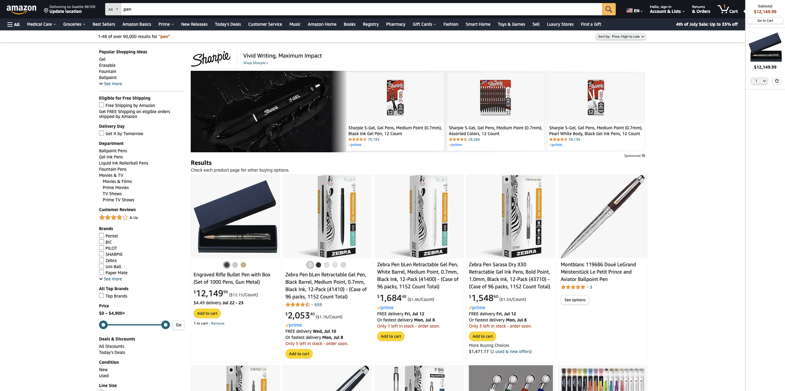

# GenAI Test Automation using Selenium

Execute functional test cases in any web application using natural language. Move away from statically coding your test cases using tools like selenium or puppeteer. Let a generative ai agent test the scenario and provide you with the test results.

This project implements an automated web UI testing framework that remotely controls a browser and simulates user interactions on a site. You can execute this project locally using AWS credentials or remotelly. If executing remotelly, a grid of containers will execute the test cases. The navigation is implemented with the help of a LLM (Claude3 Sonnet). The LLM will navigate, choosing the actions that need to be executed. LLM is aware of HTML source code, actionable elements, his past actions and remaining interactions available.

## What it does

The solution can execute different types of test cases for authentication, creation of tickets, searching for products, adding products into shopping cart, empty shopping cart etc. It simulates clicking buttons, entering data and more to try to execute a functional test case in a web application. You can integrate this test automation tool with any type of CI/CD pipeline using the architecture below:



## Requirements
To run this project, the following are needed:

- [Java 17](https://docs.aws.amazon.com/corretto/latest/corretto-17-ug/downloads-list.html) or higher
- [Apache Maven](https://maven.apache.org/download.cgi)
- [ChromeDriver](https://googlechromelabs.github.io/chrome-for-testing/) for running locally. In this case, add chromedriver to the PATH and make sure the driver version matches your browser version.
- An [AWS account](https://aws.amazon.com) with access to Amazon Bedrock and Claude3 Sonnet.
- [AWS Cloud Development Kit (CDK)](https://aws.amazon.com/cdk/) to deploy this project to AWS.
- Access to Virginia Region (us-east-1) on AWS. Update `BedrockClient.java` to use Bedrock in another Region.

## Running the sample test case (Amazon Cart)

- Clone the project repository
- Run `mvn package` to build the application
- Authenticate your CLI to your AWS environment
- Run locally using the debugger of your favorite IDE (I tested using VSCode to run App.java) or using the following command:

```
java -jar target/genai-selenium-1.0-SNAPSHOT.jar 
```
- Run remotelly using API Gateway and SQS:

```
cdk deploy test-automation
#look for SERVICE_URL Output within the Outputs tab of the test-automation stack in AWS CloudFormation
export MY_API_GATEWAY_URL = 
curl "$MY_API_GATEWAY_URL" \
	-H 'Content-Type: application/json' -d @sample-test-payload.json \
	--user "$AWS_ACCESS_KEY_ID":"$AWS_SECRET_ACCESS_KEY" \
	--aws-sigv4 "aws:amz:us-east-1:execute-api"
```

To deploy using an existing VPC, update file `cdk.json` and add the VPC id as a parameter as shown in the image below. Then run `cdk deploy test-automation`



## Test results

- The project provides a sample test case that is to navigate the amazon store and add the most expensive pen into the shopping cart.
- The prompt used is: *You are testing the amazon.com web application. Your test case is to add to cart the most expensive pen. The test case finishes when the pen is visible within the cart. You should monitor the number of items in the cart.*
- For each interaction with the web browser, the LLM is expected to provide its reasoning behind the actions it is executing.
- The sequence of screenshots below is from an execution of the sample test case. The reasoning for each step is taken from log files.
### Output
<br>

|   |  |
|:--------:|--------:|
| Step #1. Explanation: To start the search for the most expensive pen, we need to enter 'pen' in the search box and submit the search. | Step #2. Explanation: To find the most expensive pen, we need to sort the search results by price from high to low. |
<br>

|  |  |
|:--------:|--------:|
| Step #3. Explanation: The search results are now displayed, sorted by price from high to low. We need to add the first (most expensive) pen to the cart. | Step #4. Explanation: The most expensive pen has been added to the cart. Now we need to verify that it is visible in the cart and check the number of items. |
<br>

|   |
|:--------:|
| Test finished. Status: success. Explanation: The most expensive pen has been successfully added to the cart and is now visible. The cart shows 1 item, which matches our expectation. | 


## Contributing

Guideline for [contributing](CONTRIBUTING.md)

## License

This project is licensed under the [MIT-0](LICENSE) license.